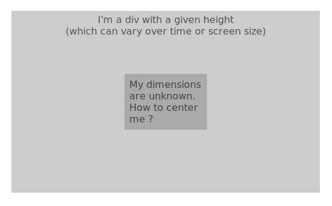
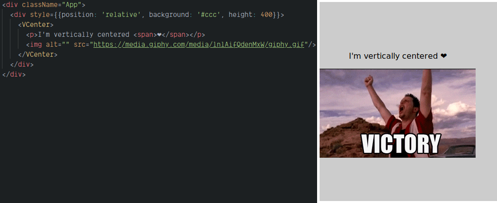
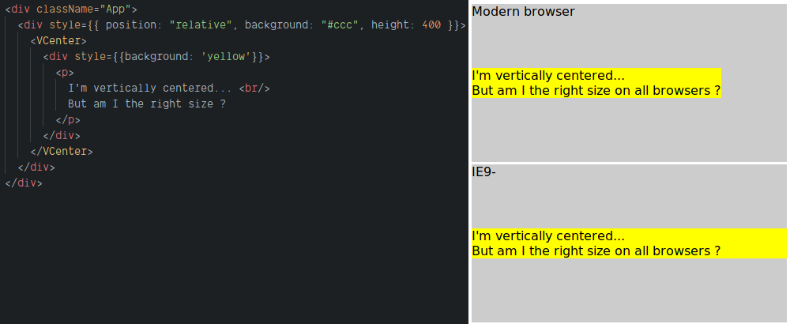
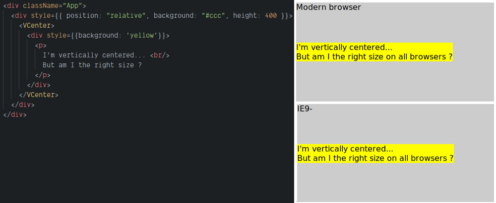

# VCenter - Forget vertical centering once and for all

"Can you align this paragraph vertically with the image on its side ?"

I heard this countless of times. I did it even more. 
But I can't help it. The two first words that come to my mind when it comes to vertical centering are "Oh Shit".
 
The next thoughts are a list of potential arguments I could use to not do it, even the weaker ones.

After - and **only** after - come the more reasonable, logical thoughts. 
"She's right, it would look better".
"It would help clear the page"...

Vertical centering has a very unique feeling associated with it for many developers.
I personally believe it's an evil lieutenant of Internet Explorer 5 and its CSS abominations.

It's like a baptism by fire for many junior web developer.
We even make memes about it.

The funny thing is: we know how to fix it, it almost never has been an impossible thing to do. 

There are countless examples on Internet. 
[StackOverflow only has more than 150000 entries on the subject](https://www.google.com/search?client=firefox-b-d&q=site%3Astackoverflow.com+vertical+align+css).
Yet, this is probably one of the most discussed topic about Web development, and junior developers keep struggling with this.

After more than 15 years of web development, I still have this emotional struggle personally.
I never remember the exact rules that I should use. 
I try to find a way to avoid it somehow.
It would be simpler to have a component that does it, quickly and simply, and forget about it once and for all.

That is why it felt natural to me to start this toolbox with `<VCenter>`, a simple, yet useful component.

## The Problem
Well, I guess I don't have to explain much about this problem... 
But for the sake of consistency, let's just illustrate with an image: 



Any rookie goes through this at least once. "That should be easy. There is this `vertical-align` rule. That should do it, right ?".
But you're not seeing that entity from hell watching you, rubbing hands and laughing while watching you as you enter the rabbit hole.


*[Learning the hard way - CommitStrip, 2015](http://www.commitstrip.com/en/2015/05/21/learning-the-hard-way/)*

For historical reasons [presented in a different article](a.the-height-problem.md), vertical centering is not only feeling like wizardry.
It's also very confusing.

Fortunately, many solutions exist. 
It shouldn't be hard to make a component that solves 90%+ of the cases, and forget about this problem once and for all. 

## Let's solve this
We will make a component that should cover this: 
- According to [the rules](b.rules.md), it should not use JS, since pure-CSS solutions exists,
- Its direct parent should have defined height (See [the article about height](a.the-height-problem.md) for the reasons we need that),
- It will take the whole space of the parent. That means it is likely going to be a `position: absolute` element,
- We won't try to cover all the corner-cases. It would be too long (150000+ SO results, remember ?). 
After all, if we need a different solution for less that 10% of the cases, it's no big deal. 

Let's go.

The intuitive way for this component to be used would be like this: 
```HTML
<div>
    <VCenter>
        <p>I'm vertically centered ❤️</p>
        <!-- or anything else -->
    </VCenter>
</div>
```

From a React point of view, it fairly simple.

There is no specific parameters to account with.
We don't need to worry about `shouldComponentUpdate` either. 
The render function is simple enough to let the children deal with whether they should update or not.

We only need `props.children`, a few styling, and we're good to go.

Let's write it as a function then:

```jsx harmony
export const VCenter = (props) => {
    return (
        <div style={{display: 'flex', alignItems: 'center', position: 'absolute', width: '100%', height: '100%', left: 0, top: 0}}>
            <div>{props.children}</div>
        </div>
    );
}
```

I used the flexbox solution as it is [well supported by modern browsers](https://caniuse.com/flexbox).

Let's check the result: 


That was easy. Now, without surprise, it is not working on IE 9.
[A very good article on CSSTricks](https://css-tricks.com/centering-the-newest-coolest-way-vs-the-oldest-coolest-way/) gives us a solution for older browsers:
```CSS
.parent {
  display: table;
  width: 100%;
}
.parent > .child {
  display: table-cell;
  vertical-align: middle;
}
```

Let's add this in the current configuration.

We define the styles to be used at boot then use it. Thanks to React, we don't need CSS hacks like in the old days.

```jsx harmony
const ieVersion = getIEVersion(); // Returns 0 if not IE, or the number if IE
const isIE9 = 0 < ieVersion && ieVersion <= 9;

const commonStyle = { 
    position: 'absolute', width: '100%', height: '100%', left: 0, top: 0, 
};
const parentStyle = Object.assign({}, commonStyle, isIE9 ? {
  display: 'table',
} : {
  display: 'flex', alignItems: 'center', 
});

const childStyle = isIE9 ? {
    display: 'table-cell', verticalAlign: 'middle',
} : null;

export const VCenter = (props) => {
    return (
        <div style={parentStyle}>
            <div style={childStyle}>
                {props.children}
            </div>
        </div>
    );
}
```
Result:


Looking good. But is it ? 

I have this intuition that maybe the dimensions are not the same in both cases. Let's check:


Of course not... 

A difference in padding sizes would have been okay, but this is too different. It could lead to issues.

Adding an extra div with `display: inline-block` in the IE9- version should do the trick:
```jsx harmony
export const VCenter = (props) => {
    return (
        <div style={parentStyle}>
            <div style={childStyle}>
                {isIE9 ? (
                    <div style={{display: 'inline-block'}}>{props.children}</div>
                ) : (
                    props.children
                )}
            </div>
        </div>
    );
}
```

Result:


Better !

## Conclusion
This component is obviously no rocket science - this toolbox is not meant to. 

As I wrote above, it is more about the relief to know that vertical centering is now a component away that matters.

It even works in IE. This is also a great thing to know. Less IE-related problems is always good news.

I'm using VCenter for a while now, and I strongly encourage you to have your own (feel free to copy mine if you like).

It won't fix all you vertical centering problems, but it will be a good match for many of them. No more "Oh Shit".
