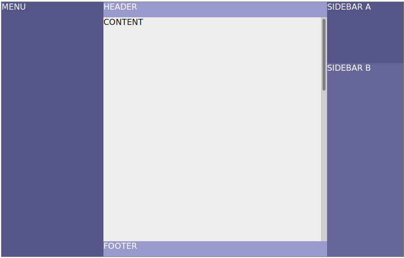
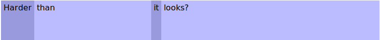
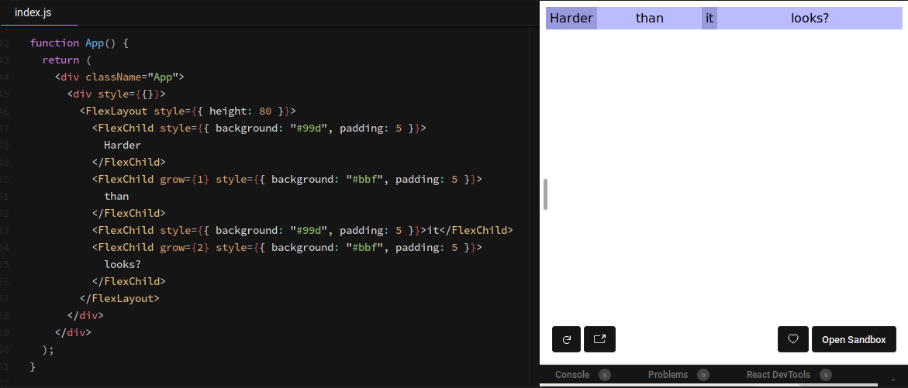
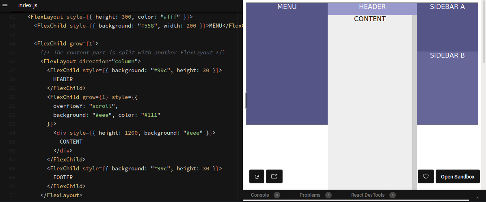
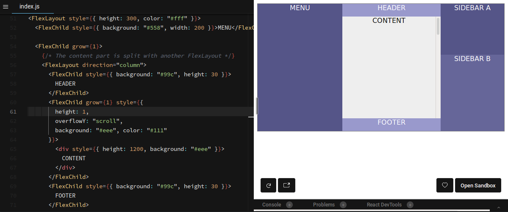

# FlexLayout - Amazing layouts with two simple components

Layouts... I think it might be the first reason why junior developers struggle with CSS.

I remember the times when the only way for complex layouts was `<table>`. 
Yes, `<table>` !!! Crazy, isn't it ?

As the adage says, "When the only thing you have is a hammer, everything looks like a nail".
Although this is a bit of a lie. 
Several alternatives were possible then but in the 2000s, the access to resources and tutorials wasn't what it is now.
Most solutions weren't obvious - is CSS ever obvious ? - and the `<table>` technique worked actually quite well.

After that, in the 2010s, I resorted to different combination of tricks found on the web, 
including `margin`, `paddding`, `float` and other rules.
The tricks were different for every different case - as it always is with CSS.
It felt like surgery, fixing something without breaking something else, somewhere else.

But we are in the 2020s now. 
~~The Beast~~ Internet Explorer has been defeated and buried by Microsoft itself. 
The browsers are up-to-date with the most useful new CSS rules.

There must be some better ways to make layout now, right ? Yes. There are.

## The Problem


Consider this common layout. 

If I was in the 2010s, I would have built it somewhat like this:
```HTML
<div style="position: absolute; width: 100%; height: 100%">
    <div style="position: absolute; width: 200px; height: 100%">
        MENU
    </div>
    <div style="position: absolute; left: 200px; right: 200px; height: 100%">
        <div style="position: absolute; top: 0; height: 30px">HEADER</div>
        <div style="position: absolute; top: 30px; bottom: 30px; width: 100%; overflow-y: scroll;">
            CONTENT
        </div>
        <div style="position: absolute; bottom: 0; height: 30px">
            FOOTER
        </div>
    </div>
    <div style="position: absolute; width: 200px; right: 0; height: 100%">
        <div style="height: 200px">
            SIDEBAR A
        </div>
        <div>
            SIDEBAR B
        </div>
    </div>
</div>
```
This is a totally valid layout... But:
- There are a lot of duplicated values - e.g. the `width` of menu must be the same as the `left` of the content section.
  This is a source of bugs in the long run.
- If the interface has to be responsive, it's likely that the menu or the sidebars would not be displayed.
  This means that the positioning of the content section has to be changed as well, for each different screen size. 
  This adds a lot of complexity in the CSS.
- It's not easy to change the layout. Imagine for instance that you want to move the header above the menu and sidebars as well.
  This means positioning the content section with a `top`, same for the menu and sidebars.
  This is not practical.
  
Is there a way to make the same layout without these problems ?

## How I've solved this
I got inspired from [the Row and Column component from the Flutter framework](https://api.flutter.dev/flutter/widgets/Row-class.html).

The layout from above can be destructured in a simpler problem: 
combining three `Column`s in a `Row`, like this:
- Row
  - Menu
  - Column
    - Header
    - Content
    - Footer
  - Column
    - Sidebar A
    - Sidebar B
       
All we need is a pair of components that split a `<div>` in smaller sections, some allowed to grow or shrink according to the width.

Flexbox is the perfect candidate for this.

But flexbox is complex, right ? 
I use it for years now and I still need to refer to [a cheatsheet](https://yoksel.github.io/flex-cheatsheet/) to use them properly.

What if I make a smaller subset of flexbox ? 
One that solve this splitting requirement, but nothing else ? 

Let's try that.

There will be two components:
1. `<FlexLayout>`: the parent component.
2. `<FlexChild>` : the child component. It should be a direct child of a `<FlexLayout>`. 
 
As always, according to [the rules](b.rules.md), it should not use JS apart from React, since pure-CSS solutions exist,

We will need a few props for this one.
- `<FlexLayout>` will need a way to tell if it's a layout in a row, or in a column. Let's call it `direction`.
- Some of the `<FlexChild>`s might want to expand according to the space available, but not all. 
  This is a CSS rule, `flex-grow`. There is also `flex-shrink`. 
  Let's use `grow` and `shrink` for props, set to 0 by default.

The intuitive way for this component to be used would be like this: 
```HTML
<FlexLayout direction='row'>
  <FlexChild>Harder</FlexChild>
  <FlexChild grow={1}>than</FlexChild>
  <FlexChild>it</FlexChild>
  <FlexChild grow={2}>looks?</FlexChild>
</FlexLayout>
```


## Let's code !

```jsx harmony
function FlexLayout(props) {
    const style = Object.assign({}, props.style, {
        flexDirection: props.direction || 'row',
        position: 'relative',
        display: 'flex',
        height: '100%',
        width: '100%',
    });
    return (
        <div {...props} style={style}>
            {props.children}
        </div>
    );
}
FlexLayout.propTypes = {
  direction: PropTypes.oneOf(['column', 'column-reverse', 'row', 'row-reverse']),
};
```

```jsx harmony
function FlexChild(props) {
    const style = Object.assign({}, props.style, {
        flexGrow: props.grow || 0,
        flexShrink: props.shrink || 0,
    });
    
    return (
        <div {...props} style={style}>
            {props.children}
        </div>
    );
}
FlexChild.propTypes = {
    grow: PropTypes.number,
    shrink: PropTypes.number,
};
```

I can't believe it is that simple. Where is the complex positioning, margin, padding surgery I'm used to ?
Let's check: 
[](https://codesandbox.io/s/xurei-tiny-components-flexlayout1-q19p5)

Well... That is amazingly simple !

Let's try the layout I used in the beginning...
[](https://codesandbox.io/s/xurei-tiny-components-flexlayout2-3v59i)

Shit. There is something wrong with the content block...

Hmm... This probably has to do with this `height: 1200` that I put to test the scrolling part...

I wonder... What happens if I add an height to the `<FlexChild>` ? 
It does not make much sense since it is allowed to `grow`, but call it an intuition.
[](https://codesandbox.io/s/xurei-tiny-components-flexlayout3-c5uuz)

Yes ! that was it. One more weirdness in the way browsers deal with `height`.

I will forget that, for sure... It might be useful to add a prop for this case...
Lets call it `canOverlay` set to `true` by default.

```jsx harmony
function FlexChild(props) {
    const canOverlay = typeof(props.canOverlay) === 'undefined' ? true : props.canOverlay;
    const style = Object.assign({
      height: canOverlay ? 'auto' : 0,
    }, props.style, {
        flexGrow: props.grow || 0,
        flexShrink: props.shrink || 0,
    });
  
    return (
        <div {...props} style={style}>
            {props.children}
        </div>
    );
}
FlexChild.propTypes = {
    grow: PropTypes.number,
    shrink: PropTypes.number,
    canOverlay: PropTypes.bool,
};
```

That's it. With that component, we should be able to cover most of the layout use cases. 
App layout, like in this example, but also tabs, **TODO compléter liste**

And it comes with a bonus: a `display: none` in the menu is enough to hide it AND resize the content section.
Also, there are no more duplicated values. Much better thant the 2010s version ! 

## Conclusion
So... Basically, it is a subset of flexbox. What's the point ?

The point is: sometimes less is more. 
These two components, which cover less cases than the full flexbox set, are less brain-consuming, at least for me.

In the end, that is all that matters: if I can produce more, with the same quality, it is a win.

I also noticed that, in a project, solutions like this one are more accessible to newcomers than pure CSS flexbox rules.
